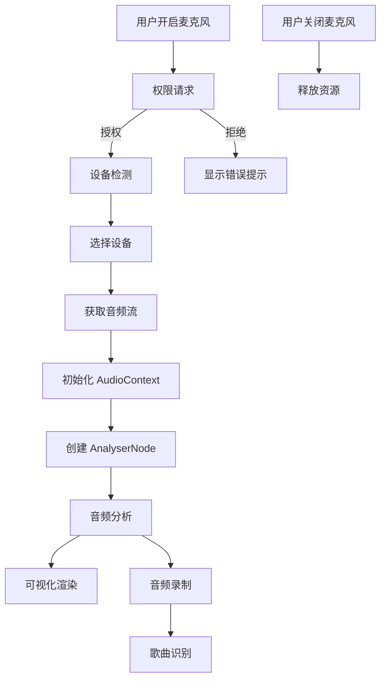
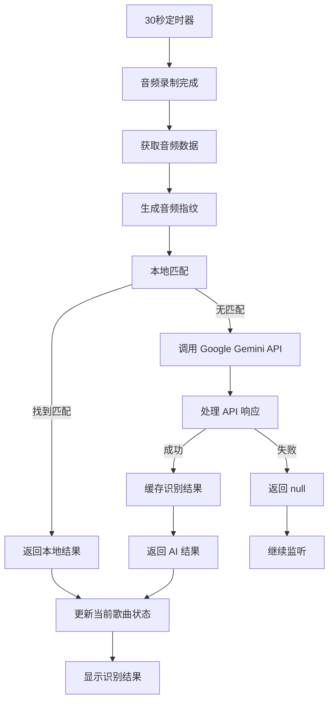
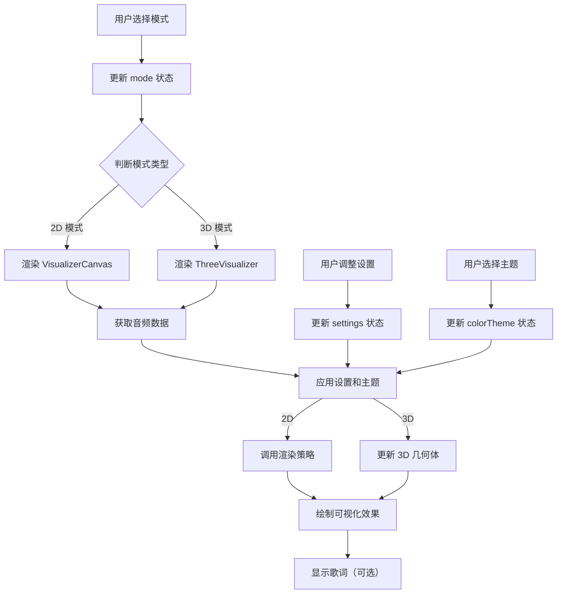
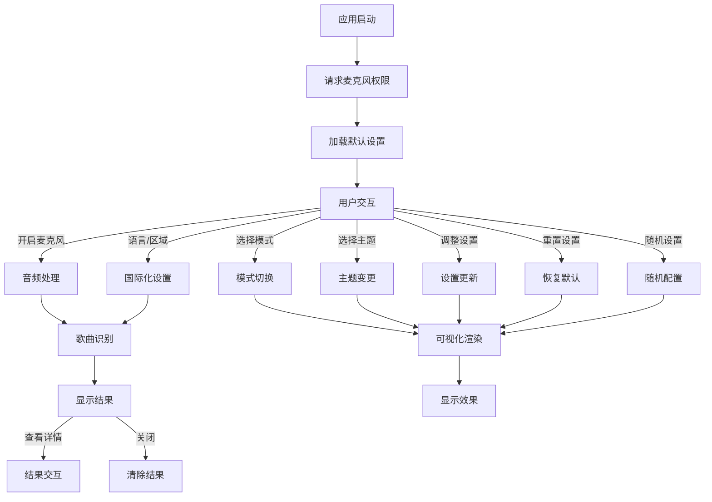

# 业务流程规范

## 概述
本文档详细描述了 SonicVision 项目的核心业务流程，包括音频处理流程、歌曲识别流程、可视化渲染流程和用户交互流程。这些流程是应用的核心功能链路，确保了从音频输入到视觉输出的完整用户体验。

## 1. 音频处理流程

### 1.1 流程概述
音频处理流程负责从用户设备获取音频输入，进行处理和分析，为可视化和歌曲识别提供基础数据。

### 1.2 详细流程

#### 步骤 1: 麦克风权限请求
1. **触发条件**：用户首次打开应用或手动开启麦克风
2. **流程**：
   - 应用调用 `navigator.mediaDevices.getUserMedia()` 请求麦克风权限
   - 浏览器显示权限请求对话框
   - 用户授权或拒绝权限
3. **错误处理**：
   - 权限被拒绝：显示友好的错误提示，引导用户在浏览器设置中启用权限
   - 设备不可用：提示用户检查麦克风连接

#### 步骤 2: 音频设备检测
1. **触发条件**：应用启动或用户进入设备选择界面
2. **流程**：
   - 调用 `navigator.mediaDevices.enumerateDevices()` 获取所有媒体设备
   - 过滤出音频输入设备
   - 格式化设备信息为 `AudioDevice` 接口
   - 更新设备列表状态
3. **集成点**：
   - 组件：Controls 组件的设备选择下拉菜单
   - 状态：App.tsx 中的 `audioDevices` 和 `selectedDeviceId` 状态

#### 步骤 3: 音频流获取
1. **触发条件**：用户开启麦克风
2. **流程**：
   - 调用 `navigator.mediaDevices.getUserMedia()` 获取音频流
   - 参数：可选指定设备 ID
   - 返回：MediaStream 对象
3. **错误处理**：
   - 设备忙：提示用户设备被其他应用占用
   - 权限错误：引导用户重新授权

#### 步骤 4: AudioContext 初始化
1. **触发条件**：获取到音频流后
2. **流程**：
   - 创建 AudioContext 实例
   - 创建 MediaStreamSourceNode 连接到音频流
   - 创建 AnalyserNode 用于音频分析
   - 连接节点：MediaStreamSourceNode → AnalyserNode
3. **配置**：
   - fftSize: 2048（影响频率数据的精度）

#### 步骤 5: 音频分析
1. **触发条件**：AnalyserNode 配置完成后
2. **流程**：
   - 定期调用 `getByteFrequencyData()` 获取频率数据
   - 将数据传递给可视化模块
   - 用于生成可视化效果
3. **更新频率**：与动画帧同步，确保流畅的可视化效果

#### 步骤 6: 音频录制
1. **触发条件**：每 30 秒自动触发或用户手动触发
2. **流程**：
   - 创建 MediaRecorder 实例
   - 录制 5 秒音频
   - 停止录制并获取音频数据
   - 将数据转换为 base64 格式
   - 传递给歌曲识别模块
3. **错误处理**：
   - 录制失败：跳过本次识别，等待下次触发
   - 数据转换错误：记录错误并继续

#### 步骤 7: 资源释放
1. **触发条件**：用户关闭麦克风
2. **流程**：
   - 停止 MediaRecorder（如果正在录制）
   - 停止 MediaStream 的所有轨道
   - 关闭 AudioContext
   - 清空相关状态
3. **重要性**：正确释放资源避免内存泄漏和性能问题

### 1.3 流程图



## 2. 歌曲识别流程

### 2.1 流程概述
歌曲识别流程负责分析音频片段，识别其中的歌曲，并提供相关信息。该流程结合了本地指纹识别和云端 AI 识别，提高识别准确率和速度。

### 2.2 详细流程

#### 步骤 1: 音频数据获取
1. **触发条件**：音频录制完成
2. **流程**：
   - 从 MediaRecorder 获取录制的音频数据
   - 转换为 base64 格式
   - 传递给识别服务
3. **数据格式**：
   - 格式：base64 编码的音频数据
   - MIME 类型：audio/webm

#### 步骤 2: 本地指纹识别
1. **触发条件**：获取到音频数据后
2. **流程**：
   - 调用 `generateFingerprint()` 生成音频指纹
   - 调用 `findLocalMatch()` 在本地缓存中查找匹配
   - 如果找到匹配，直接返回结果
3. **优势**：
   - 减少 API 调用，节省成本
   - 提高响应速度
   - 支持离线识别

#### 步骤 3: AI 歌曲识别
1. **触发条件**：本地无匹配时
2. **流程**：
   - 调用 Google Gemini API
   - 参数：base64 音频数据、MIME 类型、语言、区域
   - 系统指令：提供详细的分析指令
   - 工具：启用 googleSearch 工具
3. **集成点**：
   - 服务：geminiService.ts 中的 `identifySongFromAudio()` 方法
   - 配置：使用环境变量中的 API 密钥

#### 步骤 4: 响应处理
1. **触发条件**：API 调用完成后
2. **流程**：
   - 提取响应文本
   - 使用正则表达式提取 JSON 数据
   - 解析为 `SongInfo` 对象
   - 提取搜索链接（如果有）
   - 标记匹配来源为 'AI'
3. **错误处理**：
   - 配额错误：返回 null
   - 传输错误：最多重试 3 次
   - 其他错误：返回 null

#### 步骤 5: 结果缓存
1. **触发条件**：AI 成功识别歌曲后
2. **流程**：
   - 调用 `saveToLocalCache()` 存储识别结果
   - 参数：音频指纹、歌曲信息
   - 缓存策略：
     - 检查缓存大小限制
     - 移除最旧的条目（如果需要）
     - 保存更新后的缓存
3. **集成点**：
   - 服务：fingerprintService.ts 中的缓存管理功能
   - 存储：使用 localStorage 持久化

#### 步骤 6: 结果返回
1. **触发条件**：识别完成后
2. **流程**：
   - 更新当前歌曲状态
   - 传递歌曲信息给 UI 组件
   - 显示识别结果
3. **集成点**：
   - 状态：App.tsx 中的 `currentSong` 状态
   - 组件：SongOverlay 组件显示结果

#### 步骤 7: 周期性识别
1. **触发条件**：麦克风开启后
2. **流程**：
   - 设置 30 秒定时器
   - 定期执行识别流程
   - 避免在识别过程中重复触发
3. **集成点**：
   - 组件：App.tsx 中的 `useEffect` 钩子
   - 状态：App.tsx 中的 `isIdentifying` 状态

### 2.3 流程图



## 3. 可视化渲染流程

### 3.1 流程概述
可视化渲染流程负责将音频分析数据转换为视觉效果，包括 2D 和 3D 渲染模式，提供沉浸式的音频可视化体验。

### 3.2 详细流程

#### 步骤 1: 模式选择
1. **触发条件**：用户选择可视化模式
2. **流程**：
   - 用户在 Controls 组件中选择模式
   - 更新 `mode` 状态
   - 根据模式类型选择渲染组件
3. **集成点**：
   - 组件：Controls 组件的模式选择器
   - 状态：App.tsx 中的 `mode` 状态

#### 步骤 2: 渲染组件选择
1. **触发条件**：`mode` 状态更新后
2. **流程**：
   - 判断模式类型：2D 或 3D
   - 2D 模式：渲染 VisualizerCanvas 组件
   - 3D 模式：渲染 ThreeVisualizer 组件
3. **判断逻辑**：
   ```typescript
   const isThreeMode = mode === VisualizerMode.SILK || 
                      mode === VisualizerMode.LIQUID || 
                      mode === VisualizerMode.TERRAIN;
   ```

#### 步骤 3: 2D 渲染流程
1. **触发条件**：渲染 VisualizerCanvas 组件
2. **流程**：
   - 初始化 Canvas 元素
   - 获取 AnalyserNode 数据
   - 根据当前模式选择渲染策略
   - 调用渲染策略的 `draw()` 方法
   - 应用颜色主题和设置
   - 可选显示歌词
3. **集成点**：
   - 接口：`IVisualizerRenderer` 接口
   - 服务：visualizerStrategies.ts 中的渲染策略

#### 步骤 4: 3D 渲染流程
1. **触发条件**：渲染 ThreeVisualizer 组件
2. **流程**：
   - 初始化 Three.js 场景、相机、渲染器
   - 创建 3D 几何体
   - 获取 AnalyserNode 数据
   - 根据音频数据更新几何体
   - 应用材质和灯光
   - 执行渲染循环
3. **支持模式**：
   - SILK：丝带状效果
   - LIQUID：液体波动效果
   - TERRAIN：地形起伏效果

#### 步骤 5: 设置应用
1. **触发条件**：用户调整可视化设置
2. **流程**：
   - 用户在 Controls 组件中调整设置
   - 更新 `settings` 状态
   - 传递设置给渲染组件
   - 渲染组件应用新设置
3. **设置项**：
   - sensitivity：灵敏度
   - speed：速度
   - glow：发光效果
   - trails：轨迹效果
   - autoRotate：自动切换模式
   - rotateInterval：切换间隔
   - hideCursor：隐藏光标

#### 步骤 6: 主题应用
1. **触发条件**：用户选择颜色主题
2. **流程**：
   - 用户在 Controls 组件中选择主题
   - 更新 `colorTheme` 状态
   - 传递主题给渲染组件
   - 渲染组件应用新主题
3. **集成点**：
   - 组件：Controls 组件的主题选择器
   - 常量：COLOR_THEMES 常量中的预设主题

### 3.3 流程图



## 4. 用户交互流程

### 4.1 流程概述
用户交互流程描述了用户与应用的交互方式，包括首次启动、日常使用和设置调整等场景，确保了直观、流畅的用户体验。

### 4.2 详细流程

#### 场景 1: 首次启动
1. **流程**：
   - 应用加载，显示默认可视化效果
   - 请求麦克风权限
   - 检测默认音频设备
   - 加载默认设置和主题
   - 显示欢迎提示（可选）
2. **集成点**：
   - 组件：App.tsx 组件的初始化逻辑
   - 状态：默认状态的设置和加载

#### 场景 2: 麦克风控制
1. **流程**：
   - 用户点击麦克风按钮
   - 切换 `isListening` 状态
   - 根据状态执行开启或关闭操作
   - 显示状态反馈
2. **集成点**：
   - 组件：Controls 组件的麦克风按钮
   - 方法：App.tsx 中的 `toggleMicrophone()` 方法

#### 场景 3: 模式和主题调整
1. **流程**：
   - 用户在 Controls 组件中选择模式
   - 更新 `mode` 状态
   - 渲染相应的可视化组件
   - 用户选择颜色主题
   - 更新 `colorTheme` 状态
   - 应用新主题
3. **集成点**：
   - 组件：Controls 组件的模式和主题选择器
   - 状态：App.tsx 中的 `mode` 和 `colorTheme` 状态

#### 场景 4: 歌词控制
1. **流程**：
   - 用户切换 "显示歌词" 开关
   - 更新 `showLyrics` 状态
   - 可视化组件和 SongOverlay 组件响应状态变化
   - 用户选择歌词风格
   - 更新 `lyricsStyle` 状态
   - 应用新的歌词风格
2. **集成点**：
   - 组件：Controls 组件的歌词控制选项
   - 状态：App.tsx 中的 `showLyrics` 和 `lyricsStyle` 状态

#### 场景 5: 语言和区域设置
1. **流程**：
   - 用户选择界面语言
   - 更新 `language` 状态
   - 界面文本响应语言变化
   - 用户选择所在区域
   - 更新 `region` 状态
   - 歌曲识别优先考虑该区域的歌曲
2. **集成点**：
   - 组件：Controls 组件的语言和区域选择器
   - 状态：App.tsx 中的 `language` 和 `region` 状态

#### 场景 6: 歌曲识别结果交互
1. **流程**：
   - 系统识别到歌曲
   - 更新 `currentSong` 状态
   - SongOverlay 组件显示识别结果
   - 用户查看结果，可选：
     - 点击搜索链接：跳转到歌曲搜索结果
     - 点击重试：重新执行识别
     - 点击关闭：清除当前歌曲状态
2. **集成点**：
   - 组件：SongOverlay 组件
   - 方法：App.tsx 中的 `setCurrentSong()` 方法

#### 场景 7: 设置重置和随机化
1. **流程**：
   - 用户点击 "重置设置" 按钮
   - 应用恢复默认可视化设置
   - 用户点击 "随机设置" 按钮
   - 随机选择可视化模式和主题
   - 随机调整设置参数
2. **集成点**：
   - 组件：Controls 组件的设置控制选项
   - 方法：App.tsx 中的重置和随机化方法

### 4.3 流程图



## 5. 错误处理流程

### 5.1 流程概述
错误处理流程描述了应用中常见错误的处理方式，确保应用在遇到异常时能够优雅降级并提供友好的用户体验。

### 5.2 常见错误处理

#### 5.2.1 麦克风权限错误
- **错误类型**：权限被拒绝、权限丢失
- **处理策略**：
  - 显示友好的错误提示
  - 提供手动重试选项
  - 引导用户在浏览器设置中启用权限

#### 5.2.2 设备错误
- **错误类型**：设备不可用、设备忙、设备未找到
- **处理策略**：
  - 显示设备状态提示
  - 自动切换到默认设备
  - 提供设备重新检测选项

#### 5.2.3 API 错误
- **错误类型**：配额超限、网络错误、服务不可用
- **处理策略**：
  - 配额错误：显示 API 配额不足提示
  - 网络错误：自动重试（最多 3 次）
  - 服务错误：显示服务暂时不可用提示

#### 5.2.4 缓存错误
- **错误类型**：存储不足、缓存损坏
- **处理策略**：
  - 存储不足：自动清理旧缓存
  - 缓存损坏：重置缓存并重新开始

#### 5.2.5 渲染错误
- **错误类型**：Canvas 错误、WebGL 不支持
- **处理策略**：
  - Canvas 错误：切换到基础渲染模式
  - WebGL 不支持：禁用 3D 模式，只显示 2D 模式

### 5.3 错误处理最佳实践

1. **分层处理**：
   - 服务层：捕获并处理底层错误
   - 组件层：处理 UI 相关错误
   - 应用层：处理全局错误

2. **用户反馈**：
   - 错误提示：使用友好的错误消息
   - 视觉反馈：使用颜色和图标指示错误状态
   - 操作建议：提供明确的错误解决建议

3. **日志记录**：
   - 详细的错误日志便于调试
   - 分类错误类型便于统计和分析
   - 敏感信息脱敏处理

4. **降级策略**：
   - 功能降级：当核心功能不可用时，提供基础功能
   - 性能降级：当设备性能不足时，降低渲染复杂度
   - 网络降级：当网络不可用时，使用本地功能

## 6. 性能优化流程

### 6.1 流程概述
性能优化流程描述了应用的性能优化策略，确保应用在不同设备上都能流畅运行。

### 6.2 优化策略

#### 6.2.1 渲染优化
- **策略**：
  - 使用 requestAnimationFrame 进行动画
  - 避免在渲染循环中进行复杂计算
  - 使用 React.memo 减少不必要的组件渲染
  - 3D 渲染优化：合理使用几何体和材质

#### 6.2.2 计算优化
- **策略**：
  - 使用 Web Workers 进行密集计算
  - 缓存计算结果避免重复计算
  - 增量计算只处理必要的数据
  - 使用适当的数据结构提高查找速度

#### 6.2.3 存储优化
- **策略**：
  - 限制本地存储大小
  - 优化存储格式减少空间
  - 实现缓存过期机制
  - 压缩存储数据

#### 6.2.4 网络优化
- **策略**：
  - 本地缓存优先减少 API 调用
  - 批量处理减少请求次数
  - 合理设置重试策略
  - 监控网络状态进行降级

### 6.3 性能监控

- **监控指标**：
  - FPS：帧率监控
  - 内存使用：内存泄漏检测
  - 启动时间：应用加载速度
  - API 响应时间：网络性能

- **监控工具**：
  - Chrome DevTools Performance
  - Lighthouse
  - 自定义性能监控代码

## 7. 未来扩展流程

### 7.1 流程概述
未来扩展流程描述了应用的可扩展性设计，为后续功能扩展提供指导。

### 7.2 扩展点

#### 7.2.1 可视化模式扩展
- **扩展方式**：
  - 实现新的 `IVisualizerRenderer` 接口
  - 添加新的 VisualizerMode 枚举值
  - 更新模式选择界面

#### 7.2.2 音频处理扩展
- **扩展方式**：
  - 添加音频增强功能
  - 实现噪声 reduction
  - 支持更多音频格式

#### 7.2.3 识别服务扩展
- **扩展方式**：
  - 集成多个识别服务
  - 实现本地识别模型
  - 添加用户反馈机制

#### 7.2.4 用户界面扩展
- **扩展方式**：
  - 添加自定义主题编辑器
  - 实现布局定制功能
  - 支持更多语言

### 7.3 扩展最佳实践

1. **模块化设计**：
   - 功能模块化便于独立扩展
   - 接口定义清晰便于替换实现
   - 依赖注入便于测试和扩展

2. **向后兼容**：
   - 保持 API 兼容性
   - 数据格式版本管理
   - 渐进式功能推出

3. **性能考虑**：
   - 新功能不影响现有性能
   - 资源使用合理控制
   - 降级策略确保基础功能可用

4. **测试覆盖**：
   - 新功能完整测试
   - 集成测试确保兼容性
   - 性能测试确保流畅性